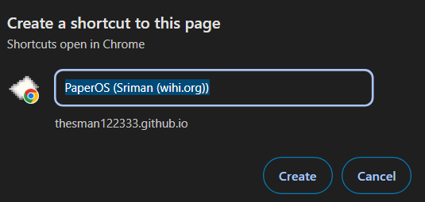

# PaperOS

PaperOS is a simple web-based operating system, its sleek, clean and packed full of features.


### Dependencies

No Prerequisites!

### Executing program

Honestly, you dont even need the code to run this, all you need to do is just save the html file :D

```
git clone https://github.com/TheSman122333/PaperOS.git
```

If you want to convert this app into a desktop app that you can launch via the windows key and typing the name, follow these steps.

# 1.
Press 3 dots (in the top-right) on https://TheSman122333.github.io/PaperOS

# 2.
Press cast, save and share, and select create shortcut.

# 3.
Name your app and bam, you got it saved under any name you choose! This method will not require any updating!




## Help

Google form to request features: https://forms.gle/x4G79pWSEcxHKHF66

To report bugs, please do it via Github.

## Authors

Contributors names and contact info

Sriman Arya
[@Litum17](https://github.com/TheSman122333)

## License

This project is licensed under the [NAME HERE] License - see the LICENSE.md file for details

## Acknowledgments

Inspiration, code snippets, etc.
* [Terbium](https://github.com/TerbiumOS/webOS)
* [LeapingTrout for landing page.](https://www.youtube.com/@learnwithleapingtrout))

